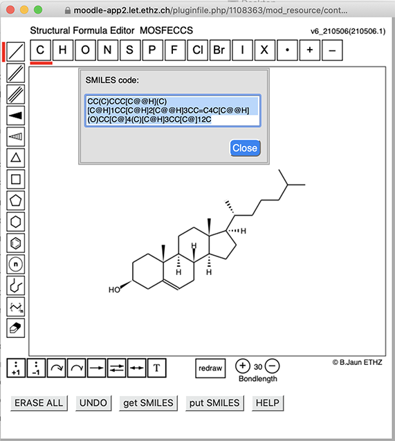

<h2>MOSFECCS Structural Formula Editor</h2>

<strong>MO</strong>lecular <strong>S</strong>tructural <strong>F</strong>ormula <strong>E</strong>ditor <strong>C</strong>alculatig <strong>C</strong>anonical <strong>S</strong>MILES

> 

<h3>Purpose and Current Use of MOSFECCS</h3>

<a href="LICENSE.md"><strong>LICENSE:</strong></a> MOSFECCS is licensed under the GNU Public License 3. <em>See</em> LICENSE.md

MOSFFECS is a HTML-Javascript application that provides an editor for molecular structural formulae in a window. It is typically installed inside a <a href="https://moodle.org/">Moodle course</a> but can also be called by a browser from a local installation on a desktop/laptop.

  
With MOSFECCS, users can draw one or several formulae interactively with the mouse or with a stylus (on touch devices). On demand, the program converts the molecular structure into an alphanumeric code (mosfeccs-SMILES) that is bi-unique for the structure and allows to enter the structure(s) into the answer fields of on-line quizzes in on-line learning environments like Moodle.

  
MOSFECCS also contains a parser that converts SMILES codes into structural formulae ("put SMILES" button). 

  
mosfeccs-SMILES are canonical (bi-unique) and mostly, but not always identical with Daylight-SMILES&trade;. For details <em>see</em> MOSFECCS-SMILES technical manual.  SMILES-extensions to specify lone-pairs, curved arrows, and reaction arrows are specific for MOSFECCS.
 
  
<em>MOSFECCS was developed with the didactics of basic organic chemistry in mind</em>. In contrast to most molecular editors that were developed as tools to enter chemical structures for database searches, MOSFECCS does not correct user errors (violations of the laws and conventions of structural theory) and allows to draw "wrong" structures.

  
MOSFECCS was coded by Bernhard Jaun, Prof. (emeritus since 2013) at the Laboratory of Organic Chemistry ETH-Zurich. So far (2015-2021), it has been used in the context of the courses Organic Chemistry I&amp;II for students of biology, pharmaceutical sciences, health sciences&amp;technology (Prof. Carlo Thilgen) at ETHZ. This course offers the students a comprehensive set of on-line trainings (quizzes, total of ca. 1000 questions) in the e-learning environment Moodle. About half of the questions require the students to draw molecular structures in an editor, convert the structure into alphanumeric code (mosfeccs-SMILES) and enter the result as answer into the quiz. The correctness of the answer is then checked on the server-side of Moodle in the same way as text or numeric answers.

  
Since 2018, the first-year examinations in Organic Chemistry I&amp;II for BIOL./PHARM./HEST (Prof. Thilgen) at ETH are carried out on-line via the Safe Exam Browser (SEB), the Moodle-exam server of ETH, and MOSFECCS as the molecular editor.

  
As of today, a total of ca. 1500 students in 6 first-year examinations have already used MOSFECCS in the exam.

<strong>MOSFECCS has been shown to work with the following operation systems and browsers:</strong>

  
<em>Mac OS 10.15.7:</em> Firefox 87, Chrome 90.0, Safari 14.0.3, SEB 2.3.2

  
<em>Windows 10:</em> Firefox 88.0, Chrome 90.0, Edge 90.0.818, SEB 2.3.2

  
<em>iOS 14.4.2:</em> Firefox, Chrome, Safari, ETH-Moodle.app

  
<em>Android:</em> Firefox, Chrome, Samsung Internet, ETH-Moodle.app

<h3>Content of the Repository and Installation</h3>

<h4>Install and use MOSFECCS</h4>

Files for installation of MOSFECCS in a Moodle course (main script compiled by Google closure compiler) MOSFECCS_v6_install_in_Moodle.zip. Consult the file "Installing MOSFECCS in Moodle.pdf" for detailed instructions.

The file "Example_Moodle_Quizz_with_MOSFECCS.xml" can be imported into a Moodle course and contains one quiz with 10 questions that illustrate the use of MOSFECCS and MOSFECCS-SMILES in different Moodle question types.

MOSFECCS can also be installed locally on a computer: download "MOSFECCS_v6_local_install_on computer.zip" to your computer, unzip and open the file MOSFECCS_v6_210506cc.html with your browser.

<h4>Documentation</h4>

MOSFECCS_MANUAL.pdf (alternatively, use the HELP button in MOSFECCS)

MOSFECCS-SMILES_technical_Manual: describes the conventions and procedures used by MOSFECCS for calculating canonical SMILES. 
 
<h4>For contributors and developers</h4>

This section contains the source code of MOSFECCS and additional tools for development
 and testing.

 

MAKEVERSION: the perl script makeversion.pl takes the development version of MOSFECCS source code:  MOSFECCS_v6_SVG_DEV_210506-1.html and generates the production versions:   MOSFECCS_v6_210506.html (source)  MOSFECCS_v6_210506cc.html (compiled) as well as the testing application mostest.js (running under nodeJS).

MOSETEST: mostest.js runs under nodeJS and accepts a file with SMILES-codes (one per line) as input. The SMILES-generator and SMILES-parser of mostest.js are identical to those of MOSFECSS since mostest.js is made by makeversion.pl from MOSFECCS. Each SMILES in the input file is converted into a structure (svg-graphic) by the parser and then the SMILES-code is calculated for the structure. mostest.js compares the input and output SMILES-codes and reports if they are not identical or if an error occurs. 

AllTestMols.txt is a testfile with ca 1300 molecules (SMILES-codes) that can be used as input for mostest.js

<h4>Contacts:</h4>

For BUG reports, suggestions for improvements and other questions related to coding: <strong>jaun@ethz.ch</strong>
 

Questions related to the use of MOSFECCS within Moodle quizzes: <strong>          thilgen@org.chem.ethz.ch</strong>

